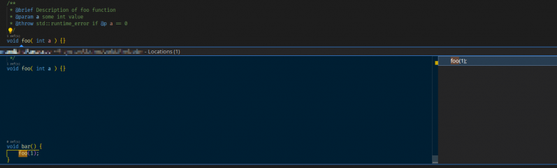

# CodeLens for clangd

This extension adds CodeLens support for a patched clangd server with applied PR [D91930](https://reviews.llvm.org/D91930).

The author of the original [extension code](https://github.com/lightmelodies/vscode-clangd/commit/46266b4adb106b5080f5c771099c777806a16adc) is [lightmelodies](https://github.com/lightmelodies).

**NOTE:** You can get the rebased and fixed version of PR **D91930** for the latest clangd version [here](https://aur.archlinux.org/cgit/aur.git/tree/lsp-codelens.patch?h=clangd-opt-git).

**This extension requires clangd with merged PR [#575](https://github.com/clangd/vscode-clangd/pull/575) (clangd 0.1.29 or newer).**
